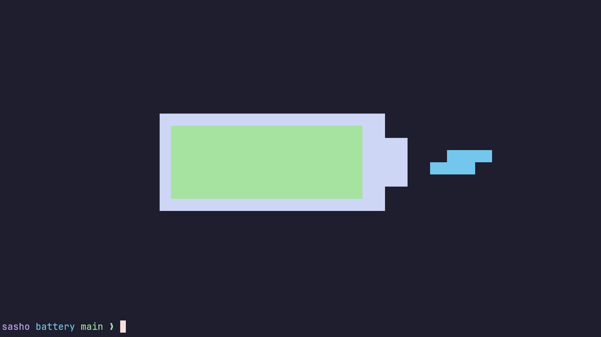
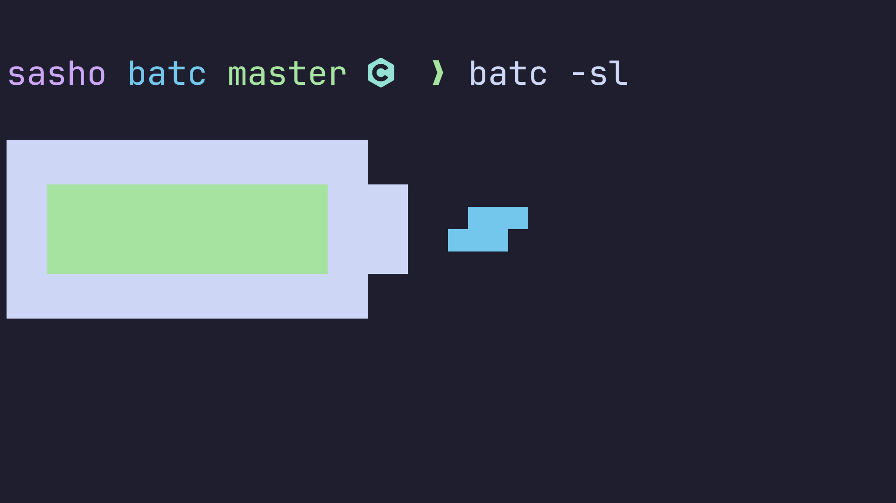

# Battery

### Simple utility to monitor the battery in a stylish manner.


### Small version:


### Version with some extra options:


## Installation

```bash
git clone https://github.com/sasheto-phizika/batc.git
cd batc && make
cp batc ~/.local/bin # user installation
sudo cp batc /usr/bin # system installation
```

## Usage

### Basic:
```
batc
```
### Options

* **-l, --live**: monitor the battery live (close with `q` or `Esc`)
* **-s, --small**: print a small inline battery instead
* **-f, --fat**: print a slightly thicker battery
* **-d, --digits**: print the current capacity as a number inside of the battery (does not work with -s)
* **-M, --mode=(mode)**: specify mode to be printed with -d (c for capacity, m for time left or to full, t for temperature)
* **-e, --extra-colors**: disable extra core color pattern for different modes
* **-m, --minimal**: print minimal text output
* **-c, --alt-charge**: use an alternate charging symbol (requires nerd fonts)
* **-n, --no-color**: remove colors
* **-b, --bat-number=(bat_number)**: specify the battery number (default is the lowest one)

## Configuration

You can create `~/.config/batc/config` in order to change the colors and the default flags (the flags then become toggles that do the opposite).

### Default configuration:

```python
# do not put quotes around the values
# colors can be [red | green | yellow | blue | magenta | cyan | white | black | none] or a hex code (e.g., #0000ff)
color_100p = green # core color between 60-100%
color_60p = yellow # core color between 20-60%
color_20p = red # core color between 0-20%

color_temp = magenta # core color in 't' mode
color_time_full = cyan # core color in 'm' mode when charging
color_time_left = blue # core color in 'm' mode when discharging

color_shell = white # color of the outer shell
color_charge = cyan # color of the charging symbol
mode = c

colors = true 
live = false 
minimal = false
small = false
digits = false
fat = false
alt_charge = false
```
