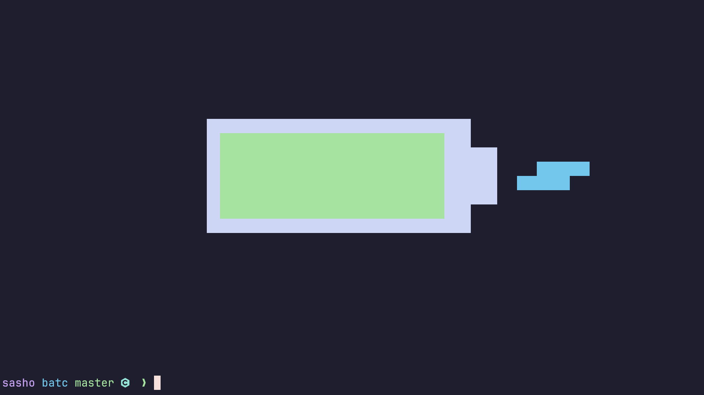
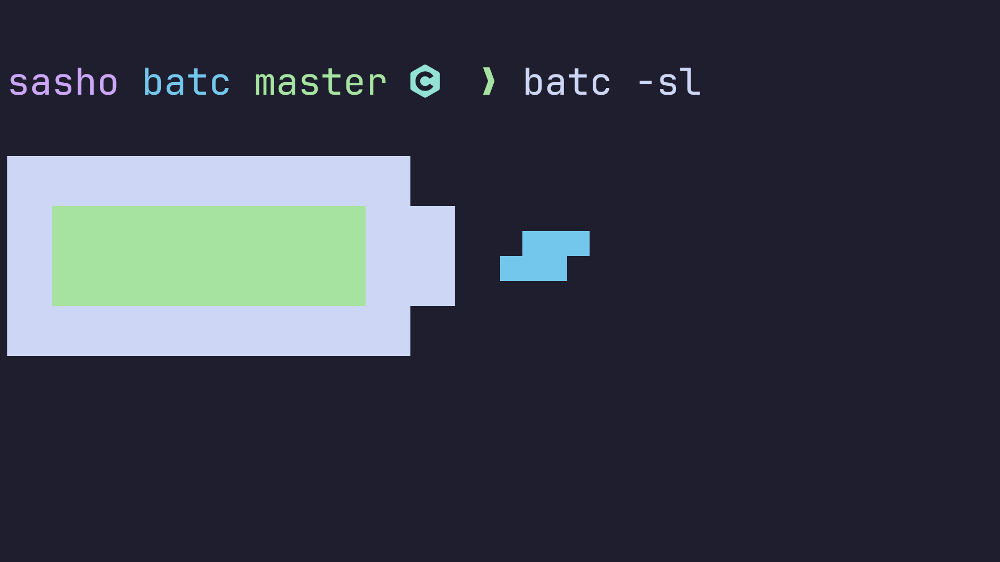
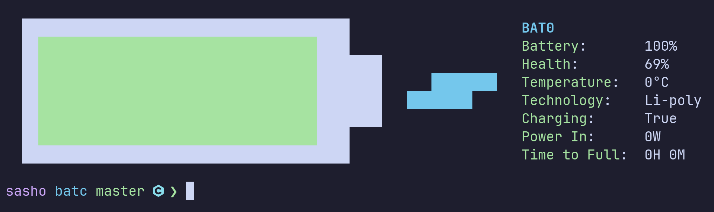

# Batc

### Simple utility to monitor the battery in a stylish manner.


### Small version:


### Version with some extra options:


### Fetch style:



## Installation

```bash
git clone https://github.com/sashetophizika/batc.git
cd batc && make
make install # user installation
sudo make install # system installation
```

## Usage

### Basic:
```
$ batc [OPTIONS]
``` 
### Options:

* **-l, --live**: monitor the battery live (close with `q` or `Esc`)
* **-i, --inline**: print the battery inline instead of the center of the screen
* **-s, --small**: print a small inline battery (requires nerd fonts)
* **-t, --tech**: print the technology of the battery shortened
* **-f, --fat**: print a slightly thicker battery
* **-F, --fetch**: adds extra information beside the battery
* **-d, --digits**: print the current capacity as a number inside of the battery (does not work with -s)
* **-M, --mode=(mode)**: specify what to be printed with -d (capacity, temperature, or health)
* **-e, --extra-colors**: disable extra core color pattern for different modes
* **-c, --alt-charge**: use an alternate charging symbol (requires nerd fonts)
* **-m, --minimal**: print minimal text output
* **-n, --no-color**: disable colors
* **-b, --bat-number=(bat_number)**: specify the battery number (default is the lowest one)

### Keybinds:
In live mode you can use some keybinds.

* **d**: toggle digits
* **t**: toggle tech
* **e**: toggle extra_colors
* **f**: toggle fat
* **c**: toggle alt_charge
* **m**: cycle mode
* **1**: capacity mode
* **2**: temp mode
* **3**: power mode
* **4**: health mode
* **5**: time mode
* **6**: charge mode

## Configuration

You can create a file named `~/.config/batc/batc.conf` or `~/.config/batc/config` in order to change the colors and the default flags (the flags then become toggles that do the opposite).

### Default configuration:

```ruby
# colors can be one of 
# [red | green | yellow | blue | magenta | cyan | white | black | none]
# or a hex code (e.g., #0000ff)

color_high = green   # core color between 60-100%
color_mid = yellow   # core color between 20-60%
color_low = red      # core color between 0-20%

color_temp = magenta # core color in 't' mode
color_in = cyan      # core color in 'p' mode when charging
color_draw = blue    # core color in 'p' mode when discharging
color_health = red   # core color in 'h' mode

color_shell = white  # color of the outer shell
color_charge = cyan  # color of the charging symbol
color_tech = cyan    # color of the technology symbol
color_number = NULL  # color of the number inside

mode = capacity      # c or capacity in percent, 
                     # t or temperature in celsius,
                     # p or power in watts,
                     # h or health in percent

bat_number = 0       # read from /sys/class/power_supply/BAT0

colors = true 
live = false 
minimal = false
small = false
inline = false
tech = false
digits = false
fat = false
alt_charge = false
```
